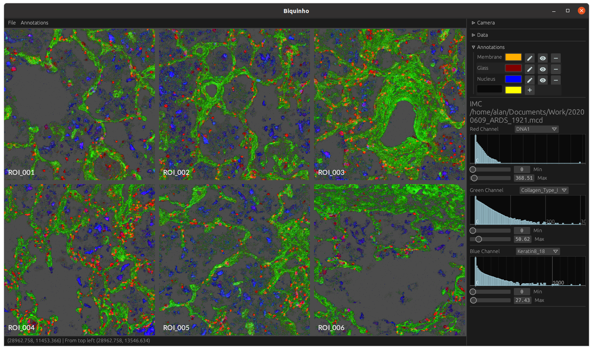

Visualisation software for imaging mass cytometry (IMC) data.

Dataset used for visualisation is available as part of an [open source study](https://github.com/ElementoLab/covid-imc) and was published by [Rendeiro et al.](https://www.nature.com/articles/s41586-021-03475-6). The exact file used is [20200609_ARDS_1921.mcd](https://zenodo.org/record/4110560#.Y2I3eUrMLJU).

# Features

- Load .mcd files and visualise optical data
- Select channels to form RGB composite with user-specified thresholds
- View multiple IMC acquisitions in single .mcd file at once (multi-camera)
- Add annotatations and annotate data (e.g. with pencil tool)
- Load and visualise cell segmentation results

[//]: # (# Planned features)

[//]: # (- View multiple .mcd files)
[//]: # (- Classify IMC data based on annotations)
[//]: # (- Segment cells based on classification data)
[//]: # (- Calculate per-cell statistics e.g. channel intensity)